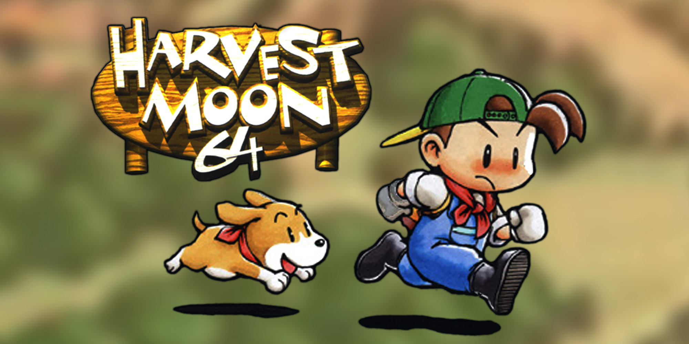

## Plant People Social Network Application

I often find myself staring into a ceramic planter filled with the remnants of miracle grow potting soil and lots of dead plants. During this crazy pandemic I decided it was a nessecity to begin maintaning a self sufficient level of fresh produce and vegtables and if possible fruits. To avoid seeing the site of unhappy (dead) plants I thought about the potential automation process that computing allows for people, and how an application dedicated to helping people grow plants could help experts and novices increase productivity. When I was a kid I enjoyed playing Harvest Moon and the idea of growing my own veggies and fruits was becoming a reality when I started growing lavender, basil and various succulents, and money-trees in my home. That being said I struggled at times and often plants started looking like the one seen below.

I want to build an application that allows people to list the current plants they have growing in their homes. I also want the application to send reminders to them on certain times to help make the process of growing plants easier and more maintable for begginers. This will make things easier for those with busy schedules and those who are novices. I also want to build an application that allows others to share what they are growing with other users and potentially help people build a community with other like minded individuals around them.

**Server Side Components**

the database service component for this application will host all user data that envolves house plants for the user which has logged in to view their collection. it will present this data to a front end model which will represent an interactive view that allows the users to examine all forms of data from these services.

**Client Side Components**

This application will be a full stack application written in within the MEAN stack. Featuring a database with Mongo.DB, Angular JS, and Express Servers. The Components will feature services for adding users, to the MongoDB service. Components which will implement services that will allow users to add plants, and even reminders for when to water and perform certain maintance. 

**Interactive Components**

There will be views for the users which will allow them to view other user's plants. there will also be a contact page for those users which will allow them to communicate and potentially trade seeds, propograted succlets, bamboo off-shoots, or even fruits and vegitables. making the whole experience from farm to table to laptop to planter. There will be a status indicator for the user's plants as well as a section that will feature common features that indicate positive growth for that user's specifica plants. 